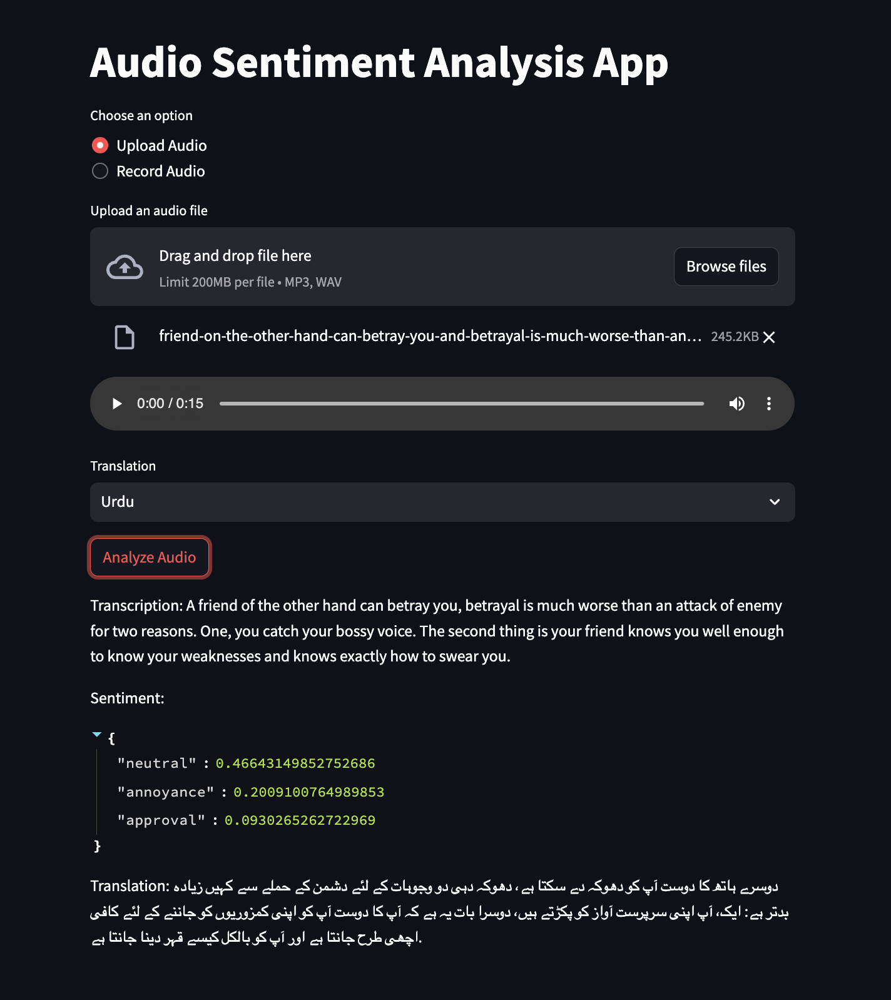

# Audio Sentiment Analysis App



## Overview

This project is an Audio Sentiment Analysis App developed using Streamlit, which allows users to transcribe audio, perform sentiment analysis, and translate the transcribed text into different languages. The app provides two options for input: uploading an audio file or recording audio directly through the application. It also support inference from cli.

## Features

- **Upload Audio**: Users can upload audio files in MP3 or WAV format.
- **Record Audio**: Users have the option to record audio directly within the application.
- **Transcription**: The app transcribes the uploaded or recorded audio into text.
- **Sentiment Analysis**: It performs sentiment analysis on the transcribed text, providing insights into the emotional tone.
- **Translation**: Users can choose from a variety of languages for translation of the transcribed text.

## Usage from Web App

1. Build using docker compose. Add your HF_API_KEY in docker compose. Get from Hugging Face for free [here]("https://huggingface.co/docs/api-inference/en/quicktour"). Comment out the `deploy` section if you don't have/want to use GPU.
```bash
docker compose up --build
```
2. Open the web browser and go to `http://localhost:8501` to access the app.

3. Choose an option for audio input: "Upload Audio" or "Record Audio."
4. If uploading audio, select an audio file (MP3 or WAV).
5. If recording audio, perform the recording within the application.
6. Choose a target language for translation from the provided options.
7. Click the "Analyze Audio" button to initiate the analysis process.
8. The app will display the transcription, sentiment analysis result, and translation.
   
## Usage from CLI
1. Once all the dependencies are installed, run from cli:
```bash
python3 cli.py --audio_path path-to-audio-file --type type-of-analysis --target target-language
```

## Dependencies

- Streamlit: Web app framework for creating interactive user interfaces.
- Pydub: Audio processing library for handling audio files.

Feel free to explore and enhance the functionality of the Audio Sentiment Analysis App according to your requirements!